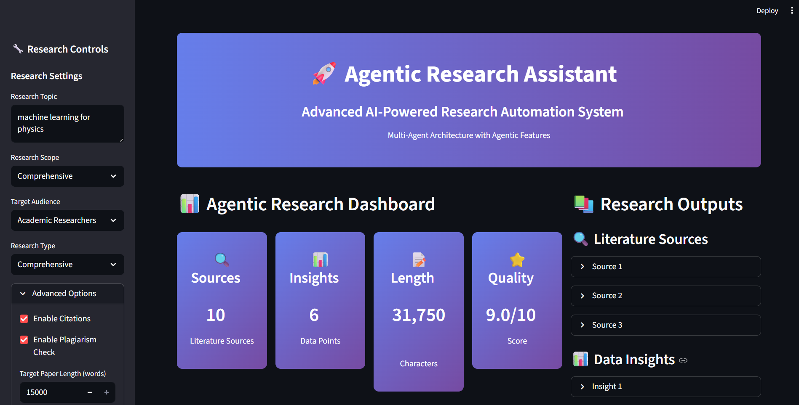

# Agentic Research Assistant

A powerful AI-powered research automation system featuring a multi-agent architecture for comprehensive academic research and paper generation.

## Features

### Multi-Agent Architecture
- **Research Director**: Strategic planning and coordination
- **Literature Agent**: Advanced literature search and analysis
- **Data Agent**: Comprehensive data collection and insights
- **Writer Agent**: Automated research paper generation
- **Editor Agent**: Quality assurance and final editing

### Research Capabilities
- Automated literature review
- Data analysis and insights
- Academic paper generation
- Citation management
- Multiple export formats

## Project Structure

```
agentic-research-assistant/
├── src/
│   ├── core/
│   │   └── assistant.py               # Core research logic
│   └── ui/
│       └── interface.py               # Agentic Streamlit UI
├── main.py                            # Main launcher script
├── requirements.txt                    # Python dependencies
├── pyproject.toml                     # Project configuration
├── config.py                          # Application configuration
├── .python-version                    # Python version specification
└── README.md                          # This file
```

## Quick Start

### 1. Clone the Repository
```bash
git clone https://github.com/thillai-c/agentic-research-assistant.git
cd agentic-research-assistant
```

### 2. Install Dependencies
```bash
pip install -r requirements.txt
```

### 3. Set Up Environment Variables
Create a `.env` file in the project root:
```env
GROQ_API_KEY=your_groq_api_key_here
TAVILY_API_KEY=your_tavily_api_key_here

# Optional: Research Configuration
RESEARCH_DEPTH=comprehensive
MAX_SOURCES=15
PAPER_TARGET_LENGTH=5000
```

**Get API Keys:**
- **GROQ**: [https://console.groq.com/](https://console.groq.com/)
- **TAVILY**: [https://tavily.com/](https://tavily.com/)

### 4. Launch the Application
```bash
python main.py
```

The application will open in your browser at `http://localhost:8501`

## Advanced Configuration

### Research Parameters
- **Research Scope**: Comprehensive, Focused, Quick Review, Deep Analysis
- **Target Audience**: Academic Researchers, Students, Professionals, General Public
- **Research Type**: Comprehensive, Literature Review, Data Analysis, Case Study
- **Paper Length**: 1,000 - 15,000 words (configurable)

### Agent Configuration
- **Max Sources**: Number of literature sources to analyze
- **Min Relevance Score**: Minimum relevance threshold for sources
- **Enable Citations**: Automatic citation generation
- **Enable Plagiarism Check**: Content originality verification

## Usage Guide

### 1. Start Research
1. Enter your research topic in the sidebar
2. Select research scope and audience
3. Choose research type
4. Click "Start Agentic Research"

### 2. Monitor Progress
- Watch real-time progress updates
- View agent activity and status
- Track completion percentage
- Monitor quality metrics

### 3. Review Results
- Literature sources with relevance scores
- Data insights and analysis
- Paper draft and final version
- Quality metrics and performance data

### 4. Export Results
- **JSON**: Complete research data
- **TXT**: Final research paper
- **Summary**: Research overview
- **Metrics**: Performance analytics

## User Interface



## Development

### Prerequisites
- Python 3.13+
- pip package manager
- Git version control

### Local Development Setup
```bash
# Clone repository
git clone https://github.com/thillai-c/agentic-research-assistant.git
cd agentic-research-assistant

# Create virtual environment
python -m venv venv
source venv/bin/activate  # On Windows: venv\Scripts\activate

# Install dependencies
pip install -r requirements.txt

# Launch development server
python main.py
```

### Code Structure
- **Core Logic**: `src/core/assistant.py`
- **UI Components**: `src/ui/interface.py`
- **Configuration**: `pyproject.toml`, `requirements.txt`
- **Launch Scripts**: `main.py`
- **Settings**: `config.py`

## Performance Metrics

The system tracks various performance indicators:
- **Completion Time**: Total research duration
- **Quality Score**: Overall research quality (0-10)
- **Source Relevance**: Average source relevance score
- **Data Insights**: Number of data points analyzed
- **Paper Length**: Generated content length

## Security & Privacy

- API keys stored in environment variables
- No data sent to external services without consent
- Local processing for sensitive research topics
- Configurable privacy settings

## License

This project is licensed under the MIT License - see the [LICENSE](LICENSE) file for details.

## Support

### Common Issues
- **API Key Errors**: Ensure your `.env` file contains valid API keys
- **Dependency Issues**: Run `pip install -r requirements.txt`
- **Port Conflicts**: Change port in launcher script if 8501 is busy

---

**Developed by ThillaiC**


